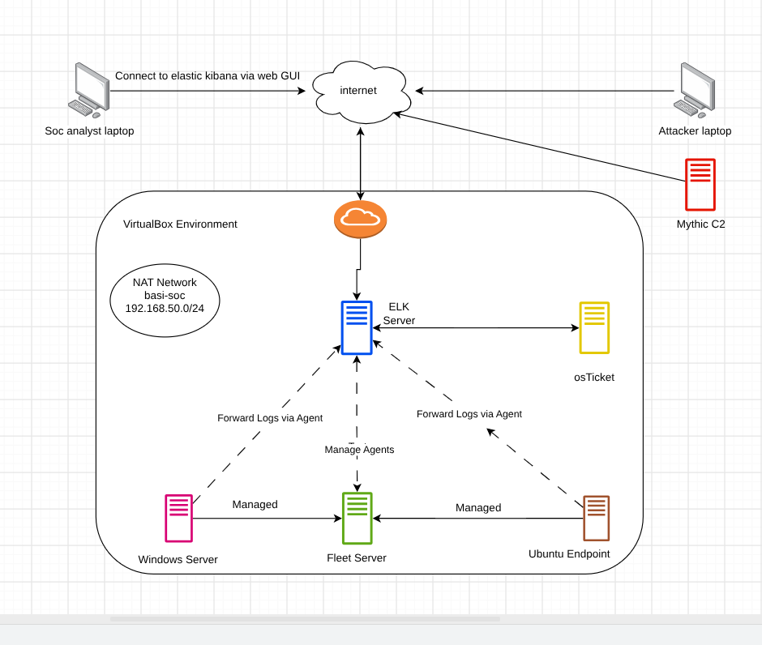

# 🛡️ Home SOC Lab

A complete Home Security Operations Center (SOC) Lab built using **VirtualBox**, **Elastic Stack**, **Fleet**, **Sysmon**, **Active Directory**, **Mythic C2**, and **osTicket** to simulate enterprise security operations.

---

# Project Overview

This project demonstrates how to build a complete home SOC environment from scratch. The lab simulates real-world cyber attacks, collects endpoint telemetry, detects malicious activities using Elastic Security, and automates incident response workflows.

The primary objective of this project is to gain hands-on experience with SOC operations, threat detection, endpoint monitoring, attack simulation, and incident management.

---

# Technology Stack

| Category | Technology |
|----------|------------|
| SIEM | Elasticsearch, Kibana |
| Endpoint Monitoring | Elastic Agent, Fleet |
| Windows Logging | Sysmon |
| Active Directory | Windows Server 2022 |
| Attack Simulation | Mythic C2 |
| Ticketing | osTicket |
| Operating Systems | Ubuntu Server, Windows Server, Ubuntu Desktop, Kali Linux |
| Virtualization | Oracle VirtualBox |

---

# Lab Components

- Elasticsearch
- Kibana
- Fleet Server
- Windows Server (Active Directory)
- Ubuntu Endpoint
- Elastic Agent
- Sysmon
- Mythic C2
- osTicket
- Kali Linux

---

# Documentation

| Guide | Link |
|-------|------|
| Lab Network | [01-lab-network.md](docs/01-lab-network.md) |
| ELK Server | [02-elk-server.md](docs/02-elk-server.md) |
| Kibana | [03-kibana.md](docs/03-kibana.md) |
| Fleet Server | [04-fleet-server.md](docs/04-fleet-server.md) |
| Endpoints | [05-endpoints.md](docs/05-endpoints.md) |
| Mythic C2 | [06-mythic-c2.md](docs/06-mythic-c2.md) |
| osTicket | [07-osticket.md](docs/07-osticket.md) |
| Detection Rules | [08-detections.md](docs/08-detections.md) |
| Automation | [09-automation.md](docs/09-automation.md) |

---

# Project Goals

- Build a realistic SOC lab
- Simulate attacker activity
- Collect endpoint telemetry
- Create Elastic detection rules
- Investigate security alerts
- Automate incident response
- Document the complete deployment

---

## Medium Article

A detailed walkthrough of the complete project is available on Medium.

🔗 **Read the full article:**  
[Building a Home SOC Lab from Scratch using VirtualBox and ELK Stack](https://medium.com/@basithmohammedali7/building-a-home-soc-lab-from-scratch-using-virtualbox-and-elk-stack-8fe12ffe647b)

---

# License

MIT License
